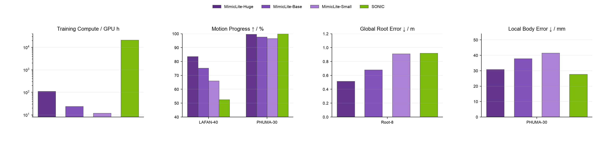

[中文版](README_cn.md) | [English](README.md)

# MimicLite

MimicLite 是一个高效、通用的人形机器人动作跟踪系统，可在 4 张 RTX 4090 上约 3.1 小时训练出可部署策略，同时保持有竞争力的跟踪效果。在统一的 MuJoCo 评测中，MimicLite 的全局根节点跟踪优于 SONIC，局部跟踪精度与其相当。同一策略已支持 Unitree G1 真机上的低延迟 Pico 实时遥操作和高动态动作跟踪。

## 项目仓库

本仓库是 MimicLite 的项目入口。训练、评测、数据转换和部署说明分别由对应仓库维护：

| 组件 | 仓库 | 内容 |
| --- | --- | --- |
| MimicLite | [`EGalahad/mimic-lite`](https://github.com/EGalahad/mimic-lite) | 训练、评测、策略导出、任务配置和学习代码。 |
| 训练框架 | [`Agent-3154/active-adaptation`](https://github.com/Agent-3154/active-adaptation) | 仿真后端、分布式启动器、环境和共享基础设施。 |
| 动作数据工具 | [`EGalahad/any4hdmi`](https://github.com/EGalahad/any4hdmi) | 动作转换、验证、可视化和数据集工具。 |
| 部署运行时 | [`EGalahad/sim2real`](https://github.com/EGalahad/sim2real) | ONNX 推理、MuJoCo sim2sim、Pico 遥操作和 Unitree G1 部署。 |

## 已发布 Checkpoint

目前发布 3 个训练 4,000 iterations 的 PPO 策略。GPU-hours 根据对应 checkpoint 的训练 runtime 和 world size 计算；下表和后续评测图使用完全相同的 checkpoint。

| 策略 | Actor hidden dimensions | 并行环境 | Checkpoint | 训练算力 |
| --- | --- | ---: | --- | ---: |
| MimicLite-Huge | `[1024, 1024, 1024]` | `32 × 8192` | [`xua2csee`](https://wandb.ai/elijahgalahad/mimic_lite/runs/xua2csee) | 139.71 GPU h |
| MimicLite-Base | `[256, 256, 256]` | `8 × 8192` | [`iij0q0b5`](https://wandb.ai/elijahgalahad/mimic_lite/runs/iij0q0b5) | 34.70 GPU h |
| MimicLite-Small | `[128, 128, 128]` | `4 × 8192` | [`zb9e19ih`](https://wandb.ai/elijahgalahad/mimic_lite/runs/zb9e19ih) | 13.79 GPU h |

上文的 3.1 小时是最新 4-GPU 系统验收结果。为避免混用不同 run 的训练成本和评测指标，checkpoint 表保留后续对比图中 3 个正式发布、完成配套评测的策略实测 GPU-hours。

与 SONIC 相比，MimicLite 在动态 LAFAN 动作上保留更多 progress，并改善全局根节点跟踪，同时保持相当的局部跟踪精度。

## 训练数据

已公开的训练数据集统一收录在 [`any4hdmi` Hugging Face collection](https://huggingface.co/collections/elijahgalahad/any4hdmi)。唯一的例外是 [`BONES-SEED` 数据集](https://huggingface.co/datasets/bones-studio/seed)：为遵守其许可证和再分发条款，用户需要从原始来源获取数据；[`EGalahad/any4hdmi`](https://github.com/EGalahad/any4hdmi) 只提供对应的转换脚本和处理工具。

## 部署支持

[`sim2real`](https://github.com/EGalahad/sim2real) 提供模块化 observation 接口，将各策略特有的输入构造与共享部署运行时分离。接入新策略只需要实现对应的 observation class 和 YAML 配置，推理、仿真器与机器人接口均保持不变。同一条公共路径已支持 MimicLite、HEFT、TeleopIT、Humanoid-GPT、BFM-Zero、SONIC 和 TWIST2 的 MuJoCo 集成评测与真机执行。Policy 推理通过可替换的 MuJoCo 和 Unitree G1 真机 backend 与机器人 I/O 解耦。

## 许可证

本集成仓库采用 GPL-3.0-or-later。各组件仓库保留自身历史和许可证文件；重新分发前需要分别确认数据集和组件许可证。
