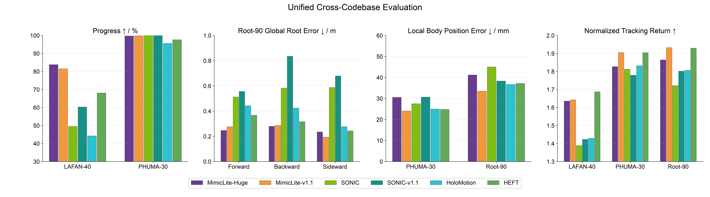

[中文版](README_cn.md) | [English](README.md)

# MimicLite

MimicLite 是一个高效、通用的人形机器人动作跟踪系统，可在 8 张 RTX 4090 上用 3 小时训练出可部署策略，同时保持有竞争力的跟踪效果。在统一的 MuJoCo 评测中，MimicLite 的全局根节点跟踪优于 SONIC，局部跟踪精度与其相当。同一策略已支持 Unitree G1 真机上的低延迟 Pico 实时遥操作和高动态动作跟踪。

技术报告位于 [`mimic-lite.pdf`](mimic-lite.pdf)。

## 项目仓库

本仓库是 MimicLite 的项目入口。训练、评测、数据转换和部署说明分别由对应仓库维护：

| 组件 | 仓库 | 内容 |
| --- | --- | --- |
| MimicLite | [`EGalahad/mimic-lite`](https://github.com/EGalahad/mimic-lite) | 训练、评测、策略导出、任务配置和学习代码。 |
| 训练框架 | [`Agent-3154/active-adaptation`](https://github.com/Agent-3154/active-adaptation) | 仿真后端、分布式启动器、环境和共享基础设施。 |
| 动作数据工具 | [`EGalahad/any4hdmi`](https://github.com/EGalahad/any4hdmi) | 动作转换、验证、可视化和数据集工具。 |
| 部署运行时 | [`EGalahad/sim2real`](https://github.com/EGalahad/sim2real) | ONNX 推理、MuJoCo sim2sim、Pico 遥操作和 Unitree G1 部署。 |

## 已发布 Checkpoint

目前发布 MimicLite v1.1 与原始 Huge PPO 版本。训练时间列给出在 RTX
4090 上的 wall-clock time。

| 策略 | Actor hidden dimensions | 并行环境 | Checkpoint | 训练时间 |
| --- | --- | ---: | --- | ---: |
| MimicLite-v1.1 | `[1024, 1024, 1024]` | `16 × 16000`（finetune 为 `15000`） | [`ece66d1a`](https://wandb.ai/elijahgalahad/mimic_lite/runs/ece66d1a) | 15 小时 29 分钟 |
| MimicLite-Huge | `[1024, 1024, 1024]` | `32 × 8192` | [`xua2csee`](https://wandb.ai/elijahgalahad/mimic_lite/runs/xua2csee) | 3 小时 30 分钟 |

原始 Huge 训练时间来源：[`55ie49o5`](https://wandb.ai/elijahgalahad/mimic_lite/runs/55ie49o5)。

MimicLite v1.1 的 deploy ONNX 和 YAML 可从
[共享 sim2real artifacts](https://drive.google.com/drive/folders/1JIIXn_gTPZC94Bg5RneID4rRaFGhX8fo) 下载。

为了公平比较，我们报告每个 policy 所需的 motion-lookahead latency，并将其定义为最远 future reference frame 对应的时间。所有数值均采用统一的 50 Hz reference-motion contract。

| Policy | MimicLite-Huge | MimicLite-v1.1 | BFM-Zero | SONIC | SONIC-v1.1 | SONIC low-latency | HoloMotion | TeleopIT | Humanoid-GPT | HEFT | TWIST2 |
| --- | ---: | ---: | ---: | ---: | ---: | ---: | ---: | ---: | ---: | ---: | ---: |
| Motion-lookahead latency | 0.08 s | 0.08 s | 0.12 s | 0.90 s | 0.90 s | 0.18 s | 0.20 s | 0.00 s | 0.02 s | 0.12 s | 0.00 s |

## 训练数据

已公开的训练数据集统一收录在 [`any4hdmi` Hugging Face collection](https://huggingface.co/collections/elijahgalahad/any4hdmi)。唯一的例外是 [`BONES-SEED` 数据集](https://huggingface.co/datasets/bones-studio/seed)：为遵守其许可证和再分发条款，用户需要从原始来源获取数据；[`EGalahad/any4hdmi`](https://github.com/EGalahad/any4hdmi) 只提供对应的转换脚本和处理工具。

## 部署支持

[`sim2real`](https://github.com/EGalahad/sim2real) 提供模块化 observation 接口，将各策略特有的输入构造与共享部署运行时分离。接入新策略只需要实现对应的 observation class 和 YAML 配置，推理、仿真器与机器人接口均保持不变。同一条公共路径已支持 MimicLite、HEFT、TeleopIT、Humanoid-GPT、BFM-Zero、SONIC 和 TWIST2 的 MuJoCo 集成评测与真机执行。Policy 推理通过可替换的 MuJoCo 和 Unitree G1 真机 backend 与机器人 I/O 解耦。

## 许可证

本集成仓库采用 GPL-3.0-or-later。各组件仓库保留自身历史和许可证文件；重新分发前需要分别确认数据集和组件许可证。
